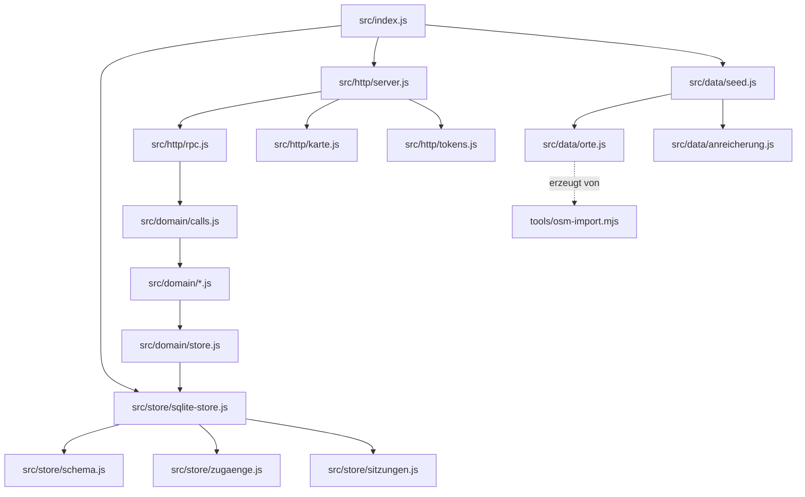

# Server

Fachlogik, Datenbank und HTTP-Schnittstelle. Ohne Fremdabhängigkeiten, `npm install` lädt nichts nach, `node src/index.js` genügt.

```bash
node src/index.js       # startet auf Port 4000
npm test                # 82 Prüfungen: Vollständigkeit, Rauchtest, Datenbank, Karte
npm run reset           # Datenbank und Kacheln weg, der nächste Start legt sie neu an
```

Braucht **Node 22.5 oder neuer** (`node:sqlite`).

---

## Was wo liegt



| Ordner | Was darin steht |
|---|---|
| `src/domain/` | Die Fachlogik. **Umgebungsneutral**, läuft auf dem Server *und* im Browser. Kein `node:fs`, kein `node:crypto`. |
| `src/store/` | Die Datenbank. Nur Server. |
| `src/http/` | Die Schnittstelle nach außen. Nur Server. |
| `src/data/` | Der Ausgangsbestand und die importierten Betriebe. |
| `tools/` | Import aus OpenStreetMap und die Prüfung der Daten. |
| `test/` | Drei Prüfdateien, zusammen 78 Prüfungen. |

Die Trennung zwischen `domain/` und dem Rest ist keine Ordnungsliebe: Die
Website führt dieselbe Fachlogik im Browser aus (eingespielte Kopie unter
`Website-/src/domain`). Ein `import` aus `node:*` dort bricht den Bau der
Website, und zwar erst dann, nicht hier.

---

## Die Datenbank

SQLite, eine Datei, richtige Tabellen. `node:sqlite` ist in Node enthalten;
es kommt nichts dazu.

- **15 Tabellen** mit Typen, Bedingungen und Indizes, `src/store/schema.js`
- **Passwörter** liegen in einer eigenen Tabelle, gehasht mit scrypt und je
  Konto eigenem Salz, `src/store/zugaenge.js`. Im Nutzerobjekt gibt es kein
  Passwortfeld; was nicht da ist, kann auch nicht in einer Antwort landen.
- **Anmeldungen** stehen ebenfalls in der Datenbank, ein Neustart wirft
  niemanden hinaus.
- **Gelesen wird aus dem Speicher, geschrieben sofort in die Datenbank.**
  Warum, und wann das nicht mehr reicht, steht oben in
  `src/store/sqlite-store.js`.

```
data/tellerrand.db        die Datenbank
data/kacheln/             Zwischenspeicher der Kartenkacheln
```

Beides steht in `.gitignore`: Es entsteht im Betrieb und gehört dem Rechner,
auf dem der Server läuft.

### Schema ändern

Spalte dazu → in `src/store/schema.js` eintragen, fertig (`IF NOT EXISTS`
legt an, was fehlt). Etwas umbauen, Spalte umbenennen, Tabelle teilen →
Schritt in `WANDERUNGEN` schreiben und `SCHEMA_FASSUNG` erhöhen.

Schreibt die Fachlogik ein Feld, das keine Spalte hat, sagt der Server das
beim Start:

```
[Daten] Ohne Spalte im Schema, deshalb nicht gespeichert: lieblingsfarbe
```

Still verlieren wäre schlimmer.

---

## Die Schnittstelle

**Ein Eingang für die Fachlogik.** Was es gibt und wer es darf, steht in
`src/domain/calls.js`, dieselbe Datei benutzt die Website im Alleinbetrieb.

```
POST /api/rpc            { method: "places.list", args: [{ radiusKm: 5 }] }
```

**Anmeldung**

```
POST /api/auth/login     { identifier, password }   identifier = E-Mail oder Benutzername
POST /api/auth/register  { email, username, name, phone, password }
POST /api/auth/password   { password }              (angemeldet)
GET  /api/auth/me
POST /api/auth/logout
```

**Zum Nachsehen mit curl**

```
GET  /api/health
GET  /api/routes
GET  /api/places?lat=48.53&lng=8.08&radiusKm=5&q=pizza
GET  /api/g/:slug
GET  /api/g/:slug/speisekarte
POST /api/reset                                     (nur Verwaltung)
```

**Karte**, siehe unten.

---

## Die Karte

Weltweit, über den eigenen Server.

```
GET /api/karte/stil                    Stil und Namensnennung
GET /api/karte/kachel/:z/:x/:y.png     eine Kachel
GET /api/karte/betriebe?nord=&sued=&west=&ost=&max=
GET /api/bild/betrieb/:slug.svg        Titelbild eines Betriebs
```

Warum über den eigenen Server statt direkt vom Gerät: ein einziger Ausgang,
ein Zwischenspeicher auf der Platte, Höflichkeit gegenüber den freien
Kachelservern, und ein Stilwechsel bleibt eine Zeile. Ausführlich in
`src/http/karte.js`.

Der Stil ist **CARTO Voyager**, von den frei nutzbaren Stilen der, der dem
Bild von Google Maps am nächsten kommt: heller entsättigter Grund, farbige
Straßen nach Rang, grüne Parks, zurückhaltende Beschriftung. Googles eigene
Kacheln sind ohne deren SDK und ein Bezahlkonto nicht zu haben.

Kommt keine Kachel durch, zeichnet der Server eine (`src/http/kachelbild.js`,
ein PNG von Hand). Eine Karte mit vierzig kaputten Bildsymbolen sieht
schlimmer aus als eine leere.

---

## Die Daten

360 echte Betriebe aus OpenStreetMap in drei Gegenden:

| Gegend | Umkreis |
|---|---|
| Alcossebre (ES) | 25 km |
| 77836 Rheinmünster | 30 km |
| 77704 Oberkirch | 30 km |

```bash
npm run testdaten           # holt sie neu (braucht Zugang zu Overpass)
npm run testdaten:pruefen   # 12 Prüfungen auf dem, was da ist
```

### Was „Testdaten holen" tut

Vom Handy aus: **Actions, „Testdaten holen"**. Der Workflow

1. fragt **Overpass** ab, die Abfrageschnittstelle von OpenStreetMap, einmal je
   Gegend: alles, was Restaurant, Café, Imbiss, Bar, Kneipe, Eisdiele,
   Biergarten, Bäckerei, Metzgerei oder Feinkostladen ist;
2. übersetzt die Treffer in unser Datenmodell (Kategorie, Küche, Angebotszeile,
   Öffnungszeiten in Minuten, Ausstattung, Bild wo vorhanden);
3. wirft Doppelte weg (OSM führt größere Lokale oft zweimal, als Punkt und als
   Gebäudefläche) und ordnet Betriebe, die in zwei Umkreisen liegen, der
   näheren Gegend zu;
4. behält je Gegend die 120 nächstgelegenen;
5. schreibt `src/data/orte.js` und **committet die Datei**, wenn sich etwas
   geändert hat.

Der Name ist inzwischen irreführend: Es sind keine Testdaten, sondern **die**
Daten. „Beispieldaten" gibt es seit Runde 9 keine mehr.

Zwei Dinge, die man wissen sollte:

- **Overpass ist ein Dienst, den Freiwillige bezahlen.** Er sagt regelmäßig
  „zu viele Anfragen", besonders zu Runnern, deren Adressen sich viele teilen.
  Der Import probiert deshalb vier Spiegel reihum, in vier Runden mit
  wachsender Pause. Eine Gegend, die trotzdem nicht durchkommt, reißt die
  anderen nicht mit: Ihr letzter Stand bleibt stehen.
- **`src/data/anreicherung.js` überlebt jeden Import.** Die Beschreibungen dort
  hängen am Kürzel, nicht an der Zeile in `orte.js`.

**Keine übernommenen Bewertungen.** Weder von Google noch von sonst woher, eine fremde Sternezahl sagt nichts darüber, was bewertet wurde, und ließe
sich nicht nachvollziehen. `tools/orte-pruefen.mjs` prüft, dass keine
hereinkommt.

**Bilder** nur aus freien Quellen (OpenStreetMap `image`, Wikimedia Commons),
und dann mit Nennung. Für alle anderen zeichnet der Server eines.

`src/data/anreicherung.js` legt Beschreibungen über die importierten Daten, in eigenen Worten, mit Quelle und Datum, und ohne Speisekarten mit Preisen.
Warum nicht, steht oben in der Datei.

---

## Konten

Kein Beispielinhalt mehr. Im Ausgangsbestand stehen die Betriebe und drei
Zugänge, sonst nichts. Der Feed ist am Anfang leer; so sieht jede Anwendung
am ersten Tag aus.

| Rolle | Anmeldung | Passwort |
|---|---|---|
| Verwaltung | `topic` | `admin` |
| Gastro | `test@gastro.de` | `12345aA?` |
| Nutzer | `test@user.de` | `12345aA?` |

> **`admin` ist kein Passwort, sondern ein Platzhalter.** Es steht in jeder
> Wortliste, die es gibt. Der Server erinnert bei jedem Start daran, solange
> es gilt. Bevor echte Menschen Konten anlegen, muss es weg.

Für die importierten Betriebe wird **kein** Konto angelegt. Wer einen davon
führt, meldet sich über „Betrieb übernehmen", dann steht am Konto auch, dass
es geprüft wurde.

---

## Vom Handy aus

**Actions, „Server über ngrok"** startet den Server und macht ihn erreichbar.

### Man sieht ihm beim Laufen zu

Solange der Lauf läuft, steht alle 30 Sekunden eine Zeile im Protokoll:

```
  Zeit  | Anfragen (wohin)                                    | Sitzungen | zuletzt
  ------+-----------------------------------------------------+-----------+--------
    3 min |    47  Karte 38, RPC 6, Bilder 2, Anmeldung 1, Fehler 0 |         1 | vor 4s
    4 min |    62  Karte 49, RPC 9, Bilder 3, Anmeldung 1, Fehler 0 |         1 | vor 1s
```

Daran sieht man, ob überhaupt jemand etwas abruft, ob die Karte Kacheln holt
und ob jemand angemeldet ist. Dieselben Zahlen gibt es unter `/api/status`.

### Die Adresse muss niemand abtippen

Der Lauf schreibt sie in `adresse.json` in dieses Repository. Der APK-Bau holt
sie sich von dort, und die App kann sie über *Einstellungen, Verbindung,
Aktuelle Adresse holen* nachladen. Einzelheiten in
[docs/ADRESSE.md](docs/ADRESSE.md).

### Das Kästchen „Von vorn anfangen"

Beim Starten des Workflows steht dort ein Häkchen:

| Häkchen | Was passiert |
|---|---|
| **leer** (Normalfall) | Die Datenbank des letzten Laufs wird eingespielt. Konten, Videos, Bewertungen und Merkzettel sind wieder da. |
| **gesetzt** | Der Lauf fängt bei null an: nur die importierten Betriebe und die drei Zugänge. |

Gesetzt wird es, wenn beim Ausprobieren etwas durcheinandergeraten ist und man
einen sauberen Stand will.

Die Datenbank wird am Ende jedes Laufs als Artefakt `datenbank` abgelegt und
beim nächsten wieder eingespielt. Grenzen und Vorbehalte stehen oben in
`.github/workflows/server-ngrok.yml`; die wichtigste: Wer das Repository lesen
darf, kann das Artefakt herunterladen.

Die Datenbank wird am Ende als Artefakt abgelegt und beim nächsten Lauf
wieder eingespielt, Konten und Beiträge bleiben also von Lauf zu Lauf
erhalten. Grenzen und Vorbehalte stehen oben in
`.github/workflows/server-ngrok.yml`; die wichtigste: Wer das Repository
lesen darf, kann das Artefakt herunterladen.

Einmalig einzurichten: Secret `NGROK_AUTHTOKEN`.
Optional: Variable `NGROK_DOMAIN` für eine feste Adresse.

---

## Prüfen

```bash
npm test
```

| Datei | Prüft |
|---|---|
| `test/smoke.mjs` | Adressen, Rechte, ein Ablauf von Anfang bis Ende, legt sich seine Daten selbst an |
| `test/datenbank.mjs` | Ob alles den Neustart übersteht. Der Server wird dafür wirklich heruntergefahren |
| `test/karte.mjs` | Kacheln, Zwischenspeicher, Marker im Ausschnitt, Zähler |

Dazu läuft vor allen dreien `tools/vollstaendig.mjs`: Es geht von
`src/index.js` aus jedem lokalen Import nach und fragt git, ob es die Datei
kennt. Das findet die eine Sorte Fehler, die kein Test findet, nämlich eine
Datei, die versehentlich in `.gitignore` gelandet ist. Lokal läuft dann alles
weiter, und erst der Runner, der frisch klont, bricht ab.

## Arbeitsregeln

Wie hier gearbeitet wird, steht in [CLAUDE.md](CLAUDE.md): bei jeder Änderung
die Abhängigkeiten prüfen, auf Fehler prüfen, Kommentare und Dokumentation
mitziehen.
